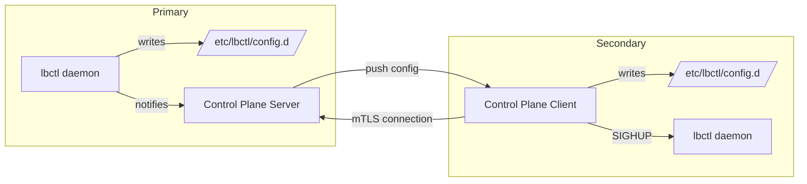

# LibraFlux Roadmap

## Overview

This document outlines planned features and enhancements for LibraFlux (lbctl) beyond Phase 01. Each feature includes technical rationale, implementation strategy, and integration points with the existing architecture.

---

## Phase 02: Advanced Health Checks & Observability

### 1. UDP Health Checks (Echo/Ack Protocol)

**Status:** Planned  
**Priority:** High  
**Complexity:** Medium

#### Problem Statement

TCP health checks (simple connect/disconnect) don't work for UDP services because UDP is connectionless. Current Phase 01 implementation only supports TCP probes, which means UDP services like DNS, SIP, or game servers cannot be accurately health-checked.

#### Solution: UDP Echo Protocol

Implement a UDP health check that sends a unique payload (nonce) and expects it back within a timeout window.

**Protocol Design:**

```
Client (lbctl)                    Backend Server
      |                                 |
      |------- UDP Packet ------------->|
      |  Payload: nonce + timestamp     |
      |                                 |
      |<------ UDP Response ------------|
      |  Payload: same nonce            |
      |                                 |
   Validate nonce match + latency
```

**Implementation Strategy:**

1. **Backend Requirements:**
   - Backend must run an echo service (e.g., `socat -u UDP4-LISTEN:8080,fork EXEC:/bin/cat`)
   - OR implement application-specific checks (DNS query, SIP OPTIONS)

2. **Config Schema Extension:**

```yaml
services:
  - name: switchboard-udp
    protocol: udp
    ports: [7543-7814]
    backends:
      - address: 192.168.94.22
        port: 0
        weight: 1
    health:
      enabled: true
      type: udp_echo          # NEW: udp_echo, udp_dns, udp_sip
      port: 8080
      interval_ms: 1000
      timeout_ms: 300
      fail_after: 3
      recover_after: 2
      payload: "PING"         # Optional custom payload
      expect: "PING"          # Expected response (default: same as payload)
```

3. **Code Changes:**

| File | Changes |
|------|---------|
| `internal/health/checker.go` | Add `UDPEchoCheck()` function with nonce generation |
| `internal/health/scheduler.go` | Support `udp_echo` check type in runner |
| `internal/config/types.go` | Add `Payload` and `Expect` fields to `HealthConfig` |
| `internal/config/validator.go` | Validate UDP check types require UDP protocol services |

4. **Nonce Generation:**

```go
func generateNonce() string {
    return fmt.Sprintf("lbctl-%d-%s", time.Now().UnixNano(), randomHex(8))
}

func udpEchoCheck(address string, port int, timeout time.Duration, payload string) error {
    nonce := generateNonce()
    fullPayload := fmt.Sprintf("%s:%s", payload, nonce)
    
    conn, err := net.DialTimeout("udp", fmt.Sprintf("%s:%d", address, port), timeout)
    if err != nil {
        return err
    }
    defer conn.Close()
    
    conn.SetDeadline(time.Now().Add(timeout))
    
    // Send
    _, err = conn.Write([]byte(fullPayload))
    if err != nil {
        return err
    }
    
    // Receive
    buf := make([]byte, 1024)
    n, err := conn.Read(buf)
    if err != nil {
        return err
    }
    
    response := string(buf[:n])
    if response != fullPayload {
        return fmt.Errorf("nonce mismatch: sent %s, got %s", fullPayload, response)
    }
    
    return nil
}
```

5. **Application-Specific Checks (Future):**
   - `udp_dns`: Send DNS query, validate response
   - `udp_sip`: Send SIP OPTIONS, expect 200 OK
   - `udp_ntp`: Send NTP query, validate response

**Testing Strategy:**

- Unit test: Mock UDP server echoing payloads
- Integration test: Real `socat` echo server
- E2E test: Health state transitions with UDP backend failures

**Documentation:**

- Update `Docs/spec.md` § Health Check section
- Add `Docs/udp-health-checks.md` with backend setup examples
- Update `dist/config.d/example-service.yaml` with UDP examples

---

### 2. Enhanced IPVS Metrics (Traffic Counters)

**Status:** Planned  
**Priority:** Medium  
**Complexity:** Low

#### Problem Statement

Current metrics focus on health and reconciliation but don't expose actual traffic statistics from IPVS. Operators need to see:
- Connection counts per backend
- Packet/byte counters
- Active vs inactive connections

#### Solution: IPVS Stats via Netlink

IPVS exposes per-destination statistics via netlink. We already use `vishvananda/netlink` for IPVS management, so we can query these stats.

**New Metrics:**

| Metric | Type | Labels | Description |
|--------|------|--------|-------------|
| `lbctl_ipvs_connections_total` | counter | node, service, backend | Total connections handled |
| `lbctl_ipvs_connections_active` | gauge | node, service, backend | Currently active connections |
| `lbctl_ipvs_packets_in_total` | counter | node, service, backend | Inbound packets |
| `lbctl_ipvs_packets_out_total` | counter | node, service, backend | Outbound packets |
| `lbctl_ipvs_bytes_in_total` | counter | node, service, backend | Inbound bytes |
| `lbctl_ipvs_bytes_out_total` | counter | node, service, backend | Outbound bytes |
| `lbctl_health_check_latency_seconds` | histogram | node, service, backend | Health check RTT |

**Implementation Strategy:**

1. **Code Changes:**

| File | Changes |
|------|---------|
| `internal/ipvs/manager.go` | Add `GetDestinationStats(svc, dest) (*Stats, error)` |
| `internal/observability/metrics.go` | Add IPVS stats metrics |
| `internal/daemon/engine.go` | Collect stats in reconcile loop (every N cycles) |

2. **Netlink Stats Query:**

```go
// internal/ipvs/manager.go
type DestinationStats struct {
    Connections      uint64
    ActiveConns      uint32
    InactiveConns    uint32
    PacketsIn        uint64
    PacketsOut       uint64
    BytesIn          uint64
    BytesOut         uint64
}

func (m *manager) GetDestinationStats(svc *Service, dest *Destination) (*DestinationStats, error) {
    // Use netlink to query IPVS stats
    ipvsSvc := &netlink.Service{
        Address:  net.ParseIP(svc.VirtualIP),
        Port:     svc.VirtualPort,
        Protocol: protocolToNetlink(svc.Protocol),
    }
    
    ipvsDest := &netlink.Destination{
        Address: net.ParseIP(dest.Address),
        Port:    dest.Port,
    }
    
    stats, err := netlink.GetDestination(ipvsSvc, ipvsDest)
    if err != nil {
        return nil, err
    }
    
    return &DestinationStats{
        Connections:   stats.Stats.Connections,
        ActiveConns:   stats.ActiveConnections,
        InactiveConns: stats.InactiveConnections,
        PacketsIn:     stats.Stats.PacketsIn,
        PacketsOut:    stats.Stats.PacketsOut,
        BytesIn:       stats.Stats.BytesIn,
        BytesOut:      stats.Stats.BytesOut,
    }, nil
}
```

3. **Collection Strategy:**

- Collect stats every N reconcile cycles (configurable, default: 5 cycles)
- Avoid collecting on every cycle to reduce netlink overhead
- Add config option: `daemon.stats_collection_interval_cycles: 5`

4. **Prometheus Histogram for Latency:**

```go
// internal/observability/metrics.go
healthCheckLatency := prometheus.NewHistogramVec(
    prometheus.HistogramOpts{
        Name:    "lbctl_health_check_latency_seconds",
        Help:    "Health check round-trip time",
        Buckets: []float64{.001, .005, .010, .025, .050, .100, .250, .500, 1.0},
    },
    []string{"node", "service", "backend"},
)
```

**Testing Strategy:**

- Unit test: Mock netlink stats responses
- Integration test: Real IPVS with traffic generation
- Verify metrics appear in Prometheus scrape

**Documentation:**

- Update `Docs/spec.md` § Metrics section
- Add example Grafana dashboard JSON

---

## Phase 03: Enterprise Features

### 3. Automatic TLS Tunnel for Config Replication

**Status:** Planned  
**Priority:** Medium  
**Complexity:** High

#### Problem Statement

In HA pairs, config changes must be replicated from Primary to Secondary. Current options:
- Manual `rsync` over SSH (requires external tooling)
- Shared NFS mount (single point of failure)
- Ansible/Puppet (heavyweight for simple pairs)

#### Solution: Built-in Control Plane with mTLS

Implement a "Control Plane" mode where the Primary node opens a mutual-TLS listener. The Secondary connects, authenticates, and receives config updates in real-time.

**Architecture:**



**Config Schema Extension:**

```yaml
# /etc/lbctl/config.yaml (Primary)
control_plane:
  enabled: true
  mode: primary
  listen_address: "0.0.0.0:8443"
  tls:
    cert: "/etc/lbctl/certs/server.crt"
    key: "/etc/lbctl/certs/server.key"
    ca: "/etc/lbctl/certs/ca.crt"  # For client cert validation

# /etc/lbctl/config.yaml (Secondary)
control_plane:
  enabled: true
  mode: secondary
  primary_address: "192.168.94.10:8443"
  tls:
    cert: "/etc/lbctl/certs/client.crt"
    key: "/etc/lbctl/certs/client.key"
    ca: "/etc/lbctl/certs/ca.crt"  # For server cert validation
  sync_interval_seconds: 30
```

**Implementation Strategy:**

1. **Certificate Generation Helper:**

```bash
lbctl setup certs --output-dir /etc/lbctl/certs
# Generates:
#   ca.crt, ca.key
#   server.crt, server.key (CN=primary)
#   client.crt, client.key (CN=secondary)
```

2. **Code Structure:**

| File | Purpose |
|------|---------|
| `internal/controlplane/server.go` | mTLS listener, config watcher, push logic |
| `internal/controlplane/client.go` | mTLS connector, config receiver, file writer |
| `internal/controlplane/protocol.go` | Wire protocol (JSON-RPC or gRPC) |
| `internal/controlplane/certs.go` | Certificate generation and validation |

3. **Protocol Design (JSON-RPC over TLS):**

```json
// Server -> Client: Config Update
{
  "jsonrpc": "2.0",
  "method": "config.update",
  "params": {
    "files": [
      {
        "path": "config.d/service1.yaml",
        "content": "base64-encoded-yaml",
        "checksum": "sha256-hash"
      }
    ],
    "deleted": ["config.d/old-service.yaml"]
  },
  "id": 1
}

// Client -> Server: Ack
{
  "jsonrpc": "2.0",
  "result": {
    "status": "applied",
    "reload_triggered": true
  },
  "id": 1
}
```

4. **Security Considerations:**

- **Mutual TLS:** Both server and client verify certificates
- **Certificate Pinning:** Optional CA pinning for extra security
- **Audit Logging:** All config pushes logged with source identity
- **Rate Limiting:** Prevent config spam attacks

5. **Fallback Behavior:**

- If control plane connection fails, Secondary continues with last known config
- Metric: `lbctl_controlplane_connected` (0/1)
- Alert on prolonged disconnection

**Testing Strategy:**

- Unit test: Mock TLS connections
- Integration test: Two lbctl instances with real certs
- E2E test: Config change on Primary, verify Secondary receives it

**Documentation:**

- Add `Docs/control-plane.md` with setup guide
- Update `Docs/spec.md` § HA Configuration Sync
- Add example systemd units for both modes

**Alternative Considered:**

- **etcd/Consul:** Heavyweight for simple pairs, adds external dependency
- **rsync over SSH:** Requires SSH key management, no real-time push
- **Shared NFS:** Single point of failure, stale reads

---

### 4. Nginx → LibraFlux Config Converter

**Status:** Planned  
**Priority:** Low  
**Complexity:** Medium

#### Problem Statement

Users migrating from Nginx `stream` blocks to LibraFlux must manually translate configs. This is error-prone and time-consuming.

#### Solution: CLI Converter Tool

Implement `lbctl convert nginx --input nginx.conf --output /etc/lbctl/config.d/` to parse Nginx `stream` and `upstream` blocks and generate equivalent LibraFlux YAML.

**Scope:**

| Nginx Feature | LibraFlux Equivalent | Supported |
|---------------|----------------------|-----------|
| `upstream` block | `backends` list | ✅ Yes |
| `server` block (L4) | `services` entry | ✅ Yes |
| `listen` directive | `ports` or `port_ranges` | ✅ Yes |
| `proxy_pass` | Implicit (backend mapping) | ✅ Yes |
| `health_check` (Nginx Plus) | `health` config | ✅ Yes |
| `least_conn` | `scheduler: lc` | ✅ Yes |
| `ip_hash` | `scheduler: sh` | ✅ Yes |
| `weight` parameter | `weight` field | ✅ Yes |
| `max_fails` / `fail_timeout` | `fail_after` / `interval_ms` | ✅ Yes (approximate) |
| SSL termination | N/A (L7 feature) | ❌ No (warn user) |
| HTTP routing | N/A (L7 feature) | ❌ No (warn user) |

**Example Conversion:**

**Input (nginx.conf):**

```nginx
stream {
    upstream postgres_cluster {
        least_conn;
        server 192.168.1.101:5432 weight=100 max_fails=3 fail_timeout=10s;
        server 192.168.1.102:5432 weight=100 max_fails=3 fail_timeout=10s;
    }
    
    server {
        listen 5432;
        proxy_pass postgres_cluster;
    }
}
```

**Output (config.d/postgres-cluster.yaml):**

```yaml
# Generated by lbctl convert nginx
# Source: nginx.conf (stream block)
# Date: 2025-12-15T10:30:00Z

services:
  - name: postgres-cluster
    protocol: tcp
    ports: [5432]
    port_ranges: []
    scheduler: lc  # Converted from least_conn
    backends:
      - address: 192.168.1.101
        port: 5432
        weight: 100
      - address: 192.168.1.102
        port: 5432
        weight: 100
    health:
      enabled: true
      type: tcp
      port: 5432
      interval_ms: 10000  # Converted from fail_timeout
      timeout_ms: 3000
      fail_after: 3       # Converted from max_fails
      recover_after: 2
```

**Implementation Strategy:**

1. **Parser:**

```go
// internal/convert/nginx.go
type NginxParser struct {
    config *NginxConfig
}

func (p *NginxParser) Parse(path string) error {
    // Use github.com/tufanbarisyildirim/gonginx for parsing
    // Or implement simple regex-based parser for stream blocks
}

func (p *NginxParser) ToLibraFlux() ([]*config.Service, error) {
    // Convert upstream + server blocks to Service structs
}
```

2. **CLI Command:**

```bash
lbctl convert nginx \
  --input /etc/nginx/nginx.conf \
  --output /etc/lbctl/config.d/ \
  --dry-run  # Preview without writing
```

3. **Warnings for Unsupported Features:**

```
⚠ WARNING: SSL termination detected in server block (line 45)
  LibraFlux operates at L4 and cannot terminate SSL.
  Consider using Nginx as L7 frontend with LibraFlux as L4 backend.

⚠ WARNING: HTTP routing detected (location blocks)
  LibraFlux cannot convert L7 HTTP rules to L4 IPVS.
  These directives will be ignored.
```

4. **Code Structure:**

| File | Purpose |
|------|---------|
| `internal/convert/nginx.go` | Nginx config parser |
| `internal/convert/mapper.go` | Nginx → LibraFlux mapping logic |
| `cmd/lbctl/convert.go` | CLI command implementation |

**Testing Strategy:**

- Unit test: Parse sample Nginx configs
- Integration test: Convert real-world Nginx configs
- Validation test: Generated YAML passes `lbctl validate`

**Documentation:**

- Add `Docs/migration-from-nginx.md`
- Include common pitfalls and limitations
- Provide side-by-side comparison examples

**Limitations:**

- Cannot convert L7 features (SSL, HTTP routing)
- Nginx Plus features (dynamic upstreams) not supported
- Complex Nginx Lua scripts ignored

---

## Phase 04: Kubernetes Integration

### 5. Kubernetes Service Controller

**Status:** Future  
**Priority:** Low  
**Complexity:** Very High

#### Problem Statement

Users running Kubernetes may want to use LibraFlux as an external L4 load balancer for `type: LoadBalancer` services instead of MetalLB or cloud providers.

#### Solution: Kubernetes Controller

Implement a Kubernetes controller that watches `Service` resources and programs LibraFlux accordingly.

**Architecture:**

```
Kubernetes API
     |
     v
lbctl-controller (watches Services)
     |
     v
lbctl API (gRPC or REST)
     |
     v
IPVS (kernel)
```

**Implementation Notes:**

- Use `client-go` for Kubernetes API interaction
- Watch `Service` resources with `type: LoadBalancer`
- Allocate VIPs from a configured pool
- Update Service `.status.loadBalancer.ingress`
- Handle Service deletion (cleanup IPVS rules)

**Out of Scope for Phase 02:**

This is a major feature requiring significant design work. Deferred to Phase 04 or later.

---

## Implementation Priority

| Feature | Priority | Complexity | Phase |
|---------|----------|------------|-------|
| UDP Health Checks | High | Medium | Phase 02 |
| Enhanced IPVS Metrics | Medium | Low | Phase 02 |
| TLS Config Replication | Medium | High | Phase 03 |
| Nginx Converter | Low | Medium | Phase 03 |
| Kubernetes Integration | Low | Very High | Phase 04+ |

---

## Contributing

Feature requests and design feedback are welcome. Please open an issue on GitHub with:
- Use case description
- Expected behavior
- Integration points with existing features

---

## References

- [Phase 01 Spec](spec.md)
- [Engineering Standards](engineering-standards.md)
- [Progress Tracker](PROGRESS.md)

